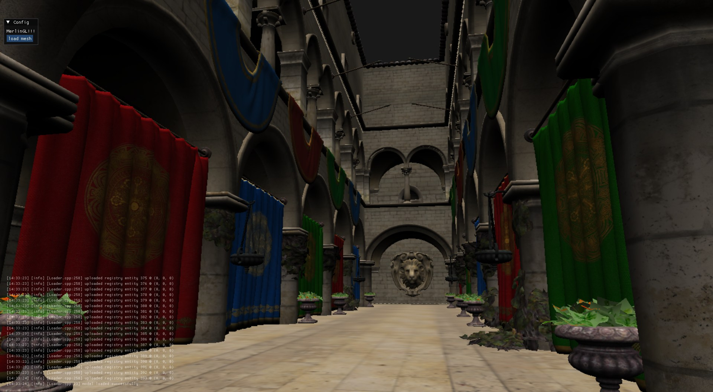

# MerlinGL

Marcel's General Purpose Renderer. Supports both point clouds and triangulated meshes.
Event system uses the observer/listener pattern

note that my .clang-format enforces 3 spacing :> ... 
this project has only been tested on MSVC

TODO: implement full API layer
TODO: implement customizable shader layer
TODO: shader hot reloading
TODO: compile with llvm/clang
